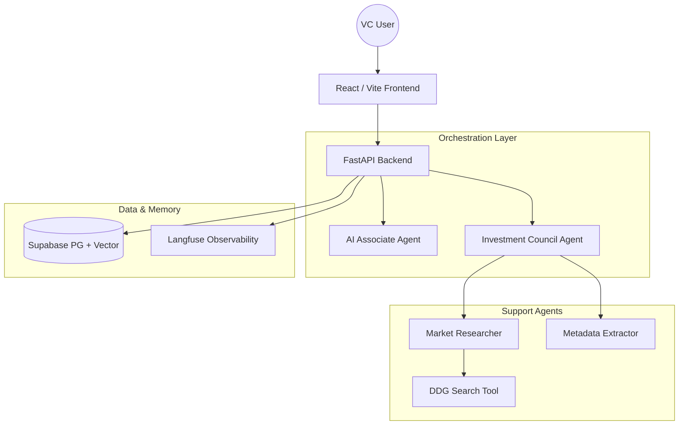

# VentureSight AI

**The Intelligence Layer for Modern Venture Capital**

VentureSight is a production-grade AI platform designed for Venture Capitalists to automate high-fidelity deal flow analysis, market verification, and pipeline management. It leverages a sophisticated Multi-Agent orchestration ("The Council") to provide balanced, unbiased investment memos while offering a conversational "AI Associate" for deep-dive portfolio queries.

> [!NOTE]
> This project was developed as a Capstone for the **NOVA IMS Data Science & AI Program (2025/2026)**.

---

## 🚀 Vision
In the fast-paced world of Venture Capital, analysts spend thousands of hours reading pitch decks, searching for market data, and comparing competitors. VentureSight was built to solve this "Analysis Paralysis" by providing an automated, multi-perspective committee that handles the heavy lifting of due diligence in seconds, not hours.

---

## 🌐 Live Demo
*   **Frontend**: [https://venture-sight-v1.vercel.app/](https://venture-sight-v1.vercel.app/)
*   **Backend API**: [https://venture-sight.onrender.com](https://venture-sight.onrender.com)

---

## 🏗 System Architecture & Workflows

VentureSight follows a modular, agent-centric architecture designed for scalability and observability.

### Functional Overview


### 1. The Investment Council (Multi-Agent Workflow)
When a pitch deck is uploaded, the **Council Service** orchestrates a four-step debate:
1.  **Extraction**: The `Metadata Extractor` parses the PDF and returns structured data (Name, Industry, TAM, Stage).
2.  **Research**: The `Market Researcher` performs live web searches to verify market size and identify 5-10 real-world competitors.
3.  **Debate**: Three distinct LLM personas analyze the data:
    -   **The Optimist**: Focuses on vision, product-market fit, and massive upside.
    -   **The Skeptic**: identifies execution risks, competitive threats, and burn rate concerns.
    -   **The Quant**: Analyzes financial mechanics, CAC/LTV (if present), and unit economics.
4.  **Consensus**: A final agent synthesizes the debate into a comprehensive **Investment Memo** and assigns a score (0-100) based on the user's investment thesis.

### 2. The AI Associate (Conversational Intelligence)
The **AI Associate** is a specialized analyst agent with tool-calling capabilities. It manages context from:
- **Long-term Memory**: User investment thesis.
- **Short-term Context**: The specific deck currently being analyzed.
- **Semantic Memory**: A Hybrid RAG system (Vector + Keyword) across the entire historical pipeline.

**Tools available to the Associate:**
- `search_web`: Fetch latest news and trends.
- `calculate_tam`: Validate market size claims.
- `analyze_competitors`: Map the competitive landscape.
- `get_pipeline_summary`: High-level stats of the current CRM.
- `add_deal`: Promote interesting startups found in chat to the formal pipeline.

---

## 🧠 Hybrid RAG Architecture
VentureSight implements a robust **Hybrid Retrieval-Augmented Generation** system to ensure high accuracy:
-   **Semantic Vector Search**: Uses OpenAI `text-embedding-3-small` and `pgvector` to find content related to the "meaning" of a user's query.
-   **Keyword Fallback**: Implements PostgreSQL `ilike` pattern matching to catch specific startup names or technical jargon that vector embeddings might occasionally miss.
-   **Contextual Chunking**: Decks are split into intelligently sized chunks with overlap to maintain semantic continuity.

---

## 🛠 Tech Stack

**Core Architecture:**
- **Backend:** Python FastAPI (Asynchronous execution)
- **AI Orchestration:** OpenAI GPT-4o / GPT-4o-mini
- **Database:** Supabase (PostgreSQL with `pgvector` for semantic search)
- **Observability:** Langfuse (Full trace logging and LLM prompt versioning)
- **Search Tooling:** DuckDuckGo Search API with `tenacity` retry logic

**Frontend Layer:**
- **Framework:** React 18 (Vite) / TypeScript
- **Styling:** TailwindCSS + Shadcn/UI (Modern Dark Theme)
- **State Management:** TanStack Query (React Query)

---

## 🧪 Installation & Detailed Setup

### Prerequisites
- Python 3.10+ & Node.js 18+
- Supabase Account
- OpenAI API Key
- Langfuse Account (Optional, for observability)

### 1. Database Setup
Execute the SQL migrations found in `backend/db/venturesight_schema.sql` within your Supabase SQL Editor. This will:
- Enable `uuid-ossp` and `vector` extensions.
- Create `pitch_decks`, `deck_chunks`, and `vc_thesis` tables.
- Set up necessary indexes for fast semantic and keyword search.

### 2. Backend Configuration
```bash
cd backend
python -m venv venv
source venv/bin/activate  # Windows: venv\\Scripts\\activate
pip install -r requirements.txt
cp .env.example .env
```
**Environment Variables (.env):**
- `OPENAI_API_KEY`: Your OpenAI key.
- `SUPABASE_URL` & `SUPABASE_KEY`: From your Supabase project settings.
- `LANGFUSE_PUBLIC_KEY` & `LANGFUSE_SECRET_KEY`: From Langfuse project settings.

Run the server:
```bash
uvicorn main:app --reload
```

### 3. Frontend Configuration
```bash
cd frontend
npm install
cp .env.example .env
```
**Environment Variables:**
- `VITE_SUPABASE_URL` & `VITE_SUPABASE_ANON_KEY`.
- `VITE_API_URL`: Usually `http://localhost:8000`.

Run the development server:
```bash
npm run dev
```

---

## 📂 Project Structure

- `backend/services/`: Centralized agent logic (Prompts, Decision Logic).
- `backend/tools/`: Discrete function-calling tools (Search, TAM, Match Scoring).
- `backend/db/`: Supabase client and migrations.
- `backend/config.py`: Centralized application settings (Models, Temps).
- `backend/services/prompts.py`: The Prompt Library (LLM Instructions).
- `docs/`: Detailed ARCHITECTURE.md and TOOLS.md references.

---

## 🛡️ Professional Standards
- **Decoupled Logic**: Prompts and Config are isolated from Python logic for easier maintenance.
- **Robust Tools**: Critical web search calls implement exponential backoff retry logic.
- **Fail-Safe Search**: If vector search fails, the system automatically falls back to keyword matching.
- **Full Traceability**: Every LLM interaction is indexed in Langfuse, allowing for detailed debugging and cost control.

---

## 👥 Our team

*   **Abdul** - Lead Developer & Architect - *Full Stack Development & System Design*
*   **Yan** - Backend Developer - *API Implementation & AI Services*
*   **Henry** - Frontend Developer - *UI/UX Design & Data Visualization*

---

**License:** MIT
